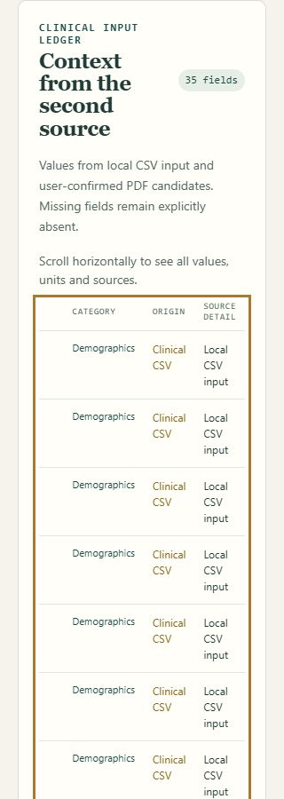
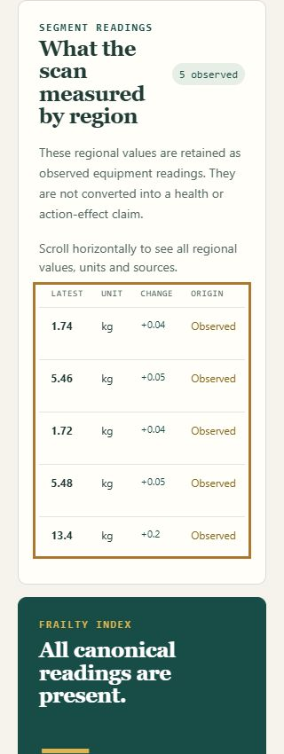

# Independent app acceptance review, 2026-10-08

Reviewer: Codex `release_review`, independent of implementation and release operations.
Contract: root GOAL.md and active LOCAL-REVIEW-1, including L7/L13. User requests an entire-app revamp, commit, and deployment. This review owns functional/visual acceptance evidence only; it does not authorize clinical use or close E-005.

## Review plan

Exercise companion Measurements → draft → approval → participant check-in → follow-up download, plus edit invalidation, explicit revocation, expiry and reload reset. Read downloaded JSON bytes. Exercise measurement complete sample, SECA-only sample, CSV intake, reset, local export and manual fill/edit/review/clear/export. Check navigation between app surfaces and evidence under both root routes and nested docs/Pages paths. Inspect representative desktop/mobile screens and keyboard focus. Scope the prior 50-page AI/PDF evidence separately: this review uses synthetic inputs and does not claim a new 50-page live extraction run.

Visual direction must use screenshot-backed Sol advisor feedback before acceptance; functional state checks remain the independent reviewer's responsibility. Required deployment reconciliation includes exact candidate commit metadata, live routes/assets and remote CI; these are owned by the release integrator.

## Initial source findings (awaiting real-UI reproduction)

- **Must fix: manual stale export.** `docs/manual.js` sets `lastPayload` at Review/Fill and enables download, but has no input/change listener that invalidates it. An edited field can be downloaded as the old reviewed value while the UI shows the new entry. Invalid submit also retains the prior Complete profile display. Expected: edits invalidate reviewed packet and disable download until successful Review.
- **Must fix: measurement reset retains prior review.** `docs/workbench.js` reset clears state but leaves enabled Review/Export workflow buttons and prior rendered DOM. Expected: after Start over, no prior record is reachable as a current review; workflow buttons are disabled until new valid input.
- **Must fix: cross-surface navigation.** Companion/manual/workbench have root-absolute links which fail at GitHub Pages `/healthspan-review/` and direct `/docs/*.html` paths. Expected: all supported deployment/path shapes navigate among app and evidence surfaces.
- **Content discrepancy:** companion says each example value has source/date, but grip card lacks a date. Add a date or narrow the claim.
- **Unverified:** browser approval lifecycle/download, keyboard/mobile layout, integrated revision and exact deployed identity. Companion's current fixed Nov 5 review date will eventually expire; acceptance should include dynamically future default date or clear safe expiry behavior.

The canonical 20-check verifier does not run the workbench/PDF/clinical parser Node suites; release evidence must retain separate complete Node execution. Existing companion tests in workbench.test.cjs assert source patterns, not approval behavior.

## Skill learning checkpoint

Expected versus observed: source-level packet and reset checks revealed state-lifecycle gaps that regex-only UI contracts cannot detect. Reusable method: exercise edit-after-review and reset-after-export before treating local-download success as current-data evidence. Applies to browser-local entry/export workflows. Owner: implementation integrator; next check: independent real-UI reproduction and targeted repair recheck.

## Runtime findings and targeted repair checks

- IAB tab against `http://127.0.0.1:8875/docs/manual.html`: Fill synthetic → Age 45 → change Age to 60. Download remained enabled and prior 35/35 review visible. Click Download reported local success. Download-event API timed out, but `C:/Users/stanc/Downloads/manual-clinical-inputs-v0.1.json` was independently read: `measurements.age` remained **45**, `units` was `{}`, `estimated_ages` was empty and clinical use forbidden. This confirms stale-export behavior and missing canonical units in direct Fill export. Integrator notified; repair recheck pending.
- After source reset repair, complete sample → Open another record produced `reviewDisabled:true`, `exportDisabled:true`, `reviewHidden:true`, `No record open.` Retained prior DOM is unreachable as current review. Reset criterion passes for this observed local state.
- New app navigation resolved companion/workbench/manual/evidence paths under `/docs/`, but the workbench's separate “Enter manually” action still resolved `/manual.html` outside `/docs/` in the observed snapshot. Integrator notified; repair recheck pending.
- Complete measurement sample rendered 35/35 fields, 2 dated scans, observed/derived provenance, region ledger, FI withheld, numeric ages withheld and descriptive-only deltas. Focus moved to review heading.

These checks occurred while builders were updating the shared source. Final acceptance must reload the stable integrated snapshot. No companion verdict is based on the temporary mixed HTML/JS state.

## Verdict

**READY for the local synthetic app-revamp scope.** Independent functional repair checks and screenshot-backed visual closeout pass. Deployment root/Pages identity remains a later release-stage check owned by the integrator. Initial findings above retain failure history; use the repair dispositions below as current status. This verdict does not close LOCAL-REVIEW-1, IR1, exact-hostname ownership or E-005.

## Integrated functional acceptance

Environment: local Windows IAB, `http://127.0.0.1:8875/docs/`, cache disabled, October 8, 2026. Reviewer authored no product code.

- Manual edit invalidation passes: after synthetic Fill, change Age 45→60 disables Download and hides old review. Review enables export; downloaded [manual-edited-after-repair.json](manual-edited-after-repair.json) contains Age 60 and canonical units. Direct Fill export [manual-fill-after-repair.json](manual-fill-after-repair.json) contains Age 45, 35 present fields, canonical units and no estimated ages. Age 150 fails with an explicit accepted-range error and export closed. Clear removes values. The original stale packet is retained as [manual-stale-before-repair.json](manual-stale-before-repair.json).
- Actual SECA file chooser produced 6/35 canonical fields and explicit missing demographics/blood/history. Actual clinical CSV chooser then produced 35/35 with no inferred values. Downloaded [combined-csv-packet.json](combined-csv-packet.json) independently read back 10 equipment-ledger entries, generic source labels, canonical units, descriptive-only comparison, `not_computed_in_browser_review` FI, empty age outputs and `clinical_use: forbidden`.
- Selectable synthetic PDF file chooser successfully inspected one page through the relative `/docs/vendor/pdfjs/pdf.worker.min.mjs` worker. Observed network after selection contained its GET and no API POST. With no consent, extraction stayed disabled; checking consent enabled it and withdrawing consent disabled it. No live AI extraction request was sent in this review.
- Companion saved draft remains locked from the participant view. Explicit approval displays v1 of snapshot HSR-042 rev 1. Difficult check-in reaches follow-up; actual downloaded [synthetic-followup-current.json](synthetic-followup-current.json) contains exact plan, snapshot/version, approval and check-in timestamps, synthetic measurement provenance and no participant name/raw file.
- Edit invalidates approval/check-in/export and increments v2. Saving/approving v2 displays only the revised action and no prior check-in. Revoke closes participant/export and clears check-in. Reset restores v1/defaults. Past review date cannot save or approve.
- Calendar expiry was exercised without product-state injection: approve through October 8, then temporarily emulate `Pacific/Kiritimati` in the isolated test tab (October 9). Participant shows Approval expired and hides action; follow-up export closes with inactive-plan explanation. Timezone restored to host/default afterward. Reload clears all approval/check-in state and generates a fresh future review date.
- Keyboard Enter on Continue moves focus to the plan heading; view changes move focus to the active title with correct step position. Actual evidence → companion → measurements → manual → evidence navigation cycle works under `/docs/`.
- Manual and companion views contain at desktop/390/320. Repaired measurement Review measures client/inner/scroll widths 320/320/320 and 390/390/390, superseding the original 342px overflow screenshot. Evidence contains at 390/320. Evidence scroll regions accept keyboard focus; ArrowRight moves scrollLeft 40px.

## Visual closeout

Screenshot-backed Sol receipts: [independent-visual-advisor.json](independent-visual-advisor.json) and [independent-visual-followup.json](independent-visual-followup.json). First accepted desktop import/companion and 390px manual shell/hierarchy, then required original-resolution 320px table left/right views. Final follow-up closes that criterion with no material remaining visible defect and no further required view. Actual reviewer-owned keyboard checks reach clinical source/provenance columns (263px maximum) and all regional Origins (53px maximum), with 40px movement after the first ArrowRight. All five workbench wrappers have distinct region labels/tab stops and visible scroll hints. Complete eGFR units are shown at the intermediate table position.

The reviewer opened and inspected the actual desktop follow-up and final original-resolution clinical/regional crops. Patient action/check-in and local-export hierarchy are legible; the final 320px table screenshots show distinct focus outlines, readable scroll hints, full source details and all five region Origins inside the panel boundaries. Scope remains these representative renders rather than accessibility conformance.

Representative evidence: [companion-followup-desktop.png](companion-followup-desktop.png), [companion-plan-mobile-390.png](companion-plan-mobile-390.png), [workbench-review-mobile-320-after.png](workbench-review-mobile-320-after.png), [manual-mobile-390.png](manual-mobile-390.png). Very long fullpage mobile images require the retained original-resolution clinical/regional crops to assess text.

Limitations: no clinical/E-005 promotion, human screen-reader/mobile-device study, five-user IR1 study, 50-page live AI rerun, or exact deployed identity is claimed by these synthetic local checks. The download-event API timed out in one earlier manual test; actual download-directory bytes were used for artifact readback instead.

Learning: invalidate review packets on input and reset workflow access at the state boundary; source-pattern tests miss these lifecycle failures. Wait for asynchronous native horizontal scrolling to settle before reading scroll offsets or capturing evidence. A long fullpage image can confirm containment but cannot substitute for original-resolution table crops. Advisor CLI output is stdout (no `--output-file` option); use PowerShell Set-Content to retain its receipt.

Advisor usage: first visual review 10,988 tokens; focused closeout 2,286 tokens. `decision_changed:true`: the first review added required narrow table reachability/crop checks and led to visible scroll hints plus labelled keyboard regions. The closeout asks for no further changes. Browser-only timezone, metrics and disabled-cache overrides are removed when the test tab is closed; product files were never modified by this reviewer.
